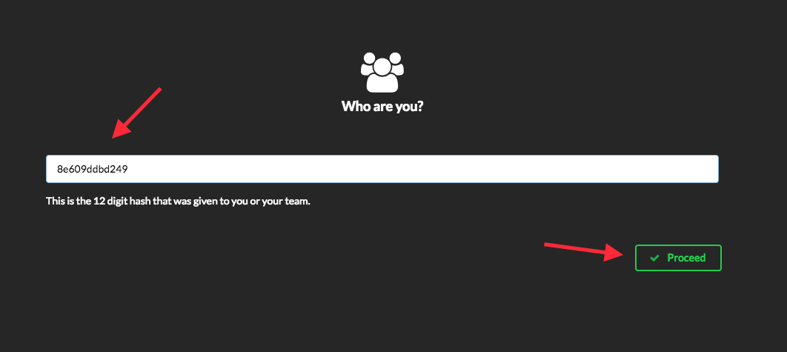
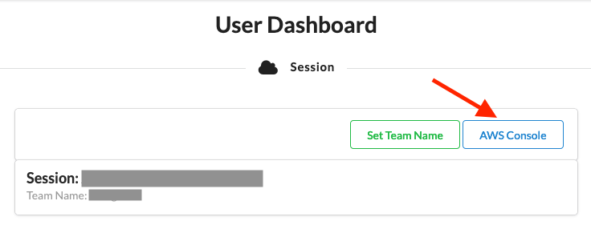
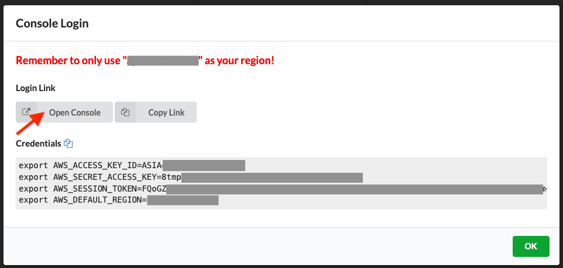
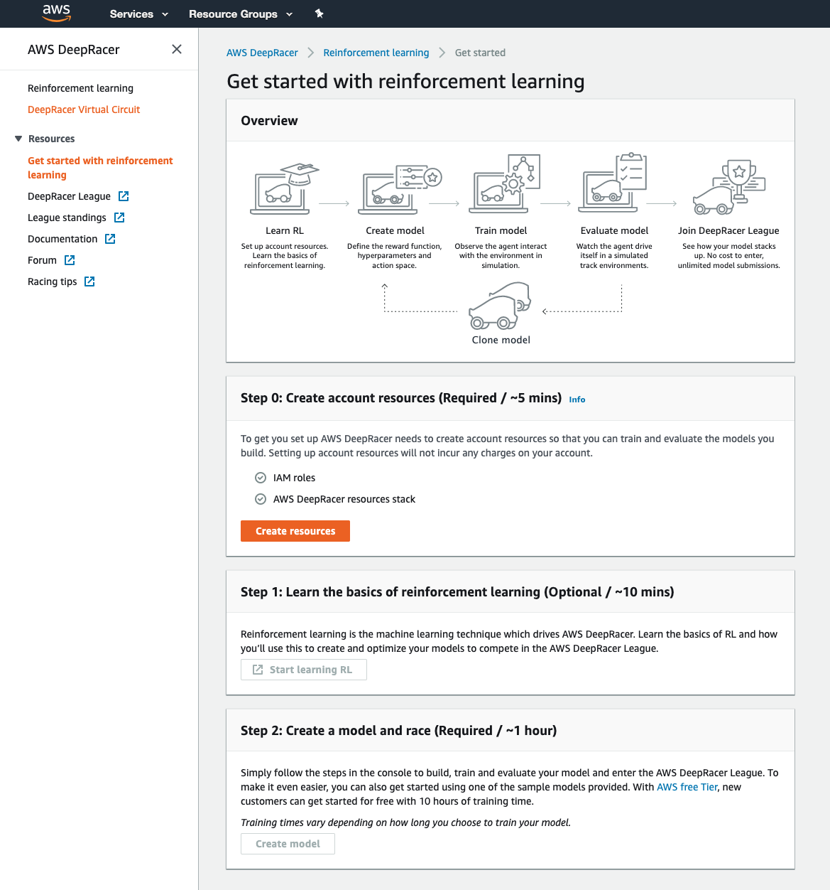
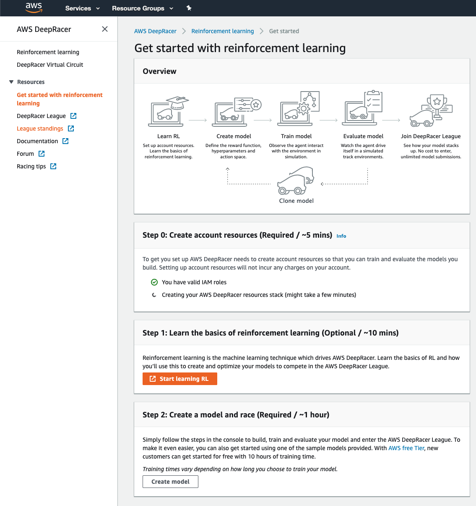
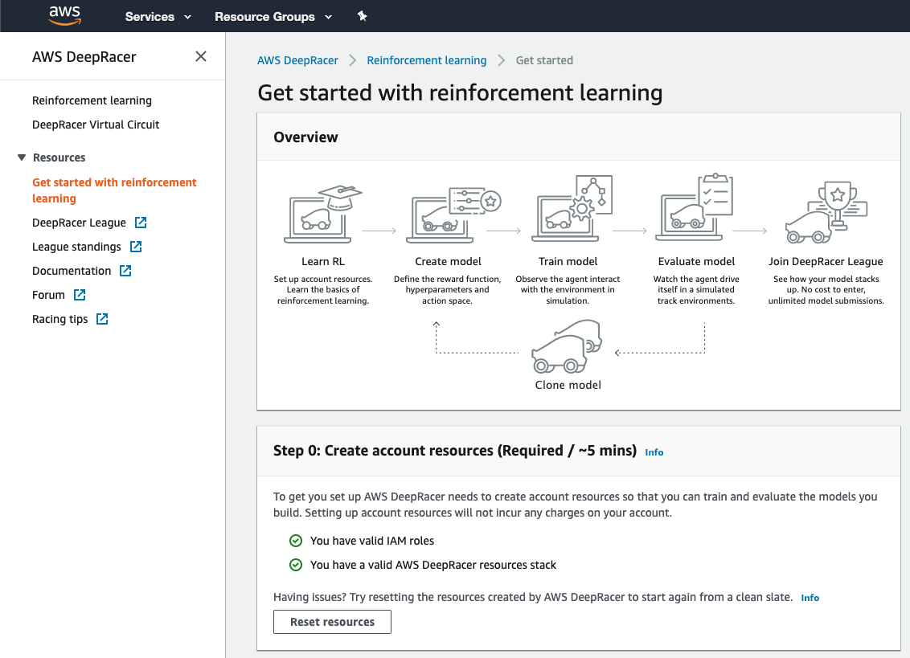

# Lab 0: Let's set up your AWS DeepRacer service and get you off to the races!

## Prerequisites - Getting a Lab Account

For this workshop, we will be issuing lab accounts for you to use to try out the services as documented. It is just like any other AWS account (with some IAM restrictions) and is completely **free to use**. You will not be charged for running any resources in these accounts. Do not store any sensitive information on these accounts. Note that the accounts will be terminated after the workshop, so do take measures to backup and save any work done.

> **Note:** As AWS accounts are a finite resource and we have obtained approval to provision them solely for this workshop's purpose, we'd like to ask you to be **frugal** on the usage.

1. Prior to the workshop, you will be sent a **12-character team hash**. If you do not have this, please sound out to the workshop facilitators for assistance.
2. Head over to the [Event Engine Dashboard](https://dashboard.eventengine.run/) to login with the hash.

  

3. Once you have logged in, you will be greeted with the **User Dashboard**. The AWS console can be access by clicking on the **AWS Console** button on the right.

  
  

> **Important:** Please use the region **N.Virginia (us-east-1)** for all resources in this lab.

4. Let's get started to train your DeepRacer Model!

# Overview
This lab is  used to set up the required resources in your AWS DeepRacer service, so you can start training your model, and racing, when we get to the main lab.

Note if you have used the service before, and have created your resources, you can skip this lab.

# Setting up the required AWS DeepRacer service resources
Log into the [AWS Console](https://console.aws.amazon.com/deepracer/home?region=us-east-1#getStarted) using your own account.

Make sure you are in the **North Virginia** region and navigate to [AWS DeepRacer](https://console.aws.amazon.com/deepracer/home?region=us-east-1#getStarted) (https://console.aws.amazon.com/deepracer/home?region=us-east-1#getStarted).

Make sure you are on the "Get started with reinforcement learning" page.

If you have not yet selected "Create resources", please select it now.

This will set up the required IAM roles, S3 bucket, and AWS DeepRacer CloudFormation stack, and may take 10 to 15 minutes.

When the create resources process is finished, you should see the following four checkmarks.

You can now select **Reinforcement learning** on the left hand navigation bar, to see create your own models or use one of the sample models to race in the League!

The next [lab](https://github.com/aws-samples/aws-deepracer-workshops/tree/master/Workshops/2019-AWSSummits-AWSDeepRacerService/Lab1) will cover racing in the League and model building

## Troubleshooting
Note that since we make use of a VPC, you may see an error if you are at your VPC limit. You may have to request a [VPC limit](https://docs.aws.amazon.com/vpc/latest/userguide/amazon-vpc-limits.html) increase.
