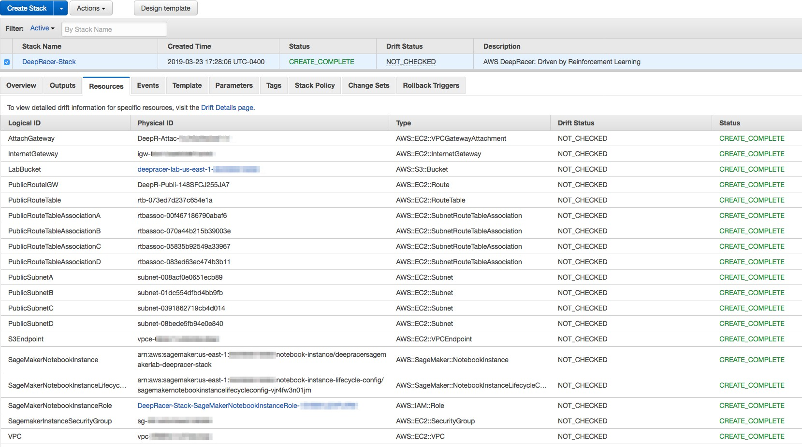

# Hands-on Exercise 3: Distributed AWS DeepRacer RL Training using
## Amazon SageMaker and AWS RoboMaker

Overview
========

In this exercise, you will train your [AWS DeepRacer](https://aws.amazon.com/deepracer/)
using reinforcement learning (RL), Amazon SageMaker RL, and the AWS
RoboMaker 3D driving simulator. AWS DeepRacer uses [Amazon SageMaker](https://aws.amazon.com/sagemaker/) to build and train its reinforcement learning
models and [AWS RoboMaker](https://aws.amazon.com/robomaker/) to create the virtual simulator
that serves as the environment the car interacts with.

Unlike the first two exercises, where you used the AWS DeepRacer
console UI to build, train, and evaluate models, in this exercise,
you\'ll interact directly with Amazon SageMaker and AWS RoboMaker. In
doing so, you will gain more control over the process of model
training, tuning, and simulation.

> \*Note: This exercise is designed to be completed in your AWS account.
> AWS DeepRacer is part of AWS Free Tier, so you can get started with
> the service at no cost. For the first month after sign-up, you are
> offered a monthly free tier of 10 hours of Amazon SageMaker training,
> and 60 simulation units of Amazon RoboMaker (enough to cover 10 hours
> of training). If you go beyond those free tier limits, you will accrue
> additional costs. For more information see the [AWS DeepRacer Pricing page](https://aws.amazon.com/deepracer/pricing/).

Learning Objectives
-------------------

By the end of this exercise, you will be able to:

1.  Configure an Amazon SageMaker environment and install the
    appropriate packages for use with AWS DeepRacer

2.  Use Amazon SageMaker to build, train, and evaluate a reinforcement
    learning model for AWS DeepRacer

3.  Create, launch, and visualize a simulated environment in AWS
    RoboMaker

Technical Prerequisites
-----------------------

-   Experience using AWS technologies, including Amazon SageMaker

-   Basic understanding of machine learning concepts, particularly RL
    and how it applies to AWS DeepRacer

-   Experience building and training models in the AWS DeepRacer console

Task 1: Create an Amazon SageMaker notebook instance
====================================================

Before you can start building and training your reinforcement learning
model with Amazon SageMaker, you need to create an Amazon SageMaker 
notebook instance. This includes launching an AWS CloudFormation
template that will provision the services you need for this exercise.

To do that, follow the steps below.

1.  In your AWS account, go to the AWS Management Console.

2.  At the top right corner, in the **Regions** dropdown menu, choose
    us-east-1 .

3.  From the console, click **Services**, enter **CloudFormation** in
    the search box, and select **AWS CloudFormation**.

> Note: The following instructions are based off of the current default
> version of the AWS CloudFormation console. If you opt to use the new
> version of the service console, please note that the following
> instructions will not align perfectly to the console UI.

4.  In the AWS CloudFormation console, select **Create Stack**.

5.  On the **Select Template** page, in the **Choose a Template**
    section, select the **Upload a template to Amazon S3** option. Click
    **Browse**, navigate to your local drive, and choose
    **SageMakerForDeepRacerSetup.yaml**. Then click **Next**.

 **Note:** Locate the [**SageMakerForDeepRacerSetup.yaml**](https://raw.githubusercontent.com/p55t/aws-deepracer-workshops/master/Workshops/2019-AWSSummits-AWSDeepRacerService/Lab2_Sagemaker/SageMakerForDeepRacerSetup.yaml) CloudFormation template file which in this repository.

6.  Enter a name for the stack (for example,
    SageMaker-For-DeepRacer-Stack), keep the default settings and click
    **Next.**

> **Note:** If this is the second stack you're creating, make sure to
> choose the option **False** under **CreateS3Bucket.** If this is the first stack you're creating, you
> can disregard this note.

7.  Accept the default settings on **Options** screen and click
    **Next**.

8.  Check the box next to "I acknowledge\..." and click **Create**.

9.  Wait 4 to 5 minutes for your stack to be created. When it completes,
    you will see the status as "CREATE\_COMPLETE" in green, as shown in
    the **Resources** tab below.

> {width="6.567270341207349in"
> height="3.6693744531933508in"}

10. Next, open the **Outputs** tab and click the link next to
    **SagemakerNotebook**. This will open up an Amazon SageMaker
    notebook instance.

{width="6.468672353455818in"
height="1.6171872265966754in"}

> **Note:** You can also open a notebook instance using the Amazon
> SageMaker console. To open a notebook instance this way, navigate to
> **Services**. From the console, open **Amazon SageMaker**. In the left
> navigation pane, click **Notebook instances**. Look for a running
> instance with a name like **DeepRacerSageMakerLabs-\$stackname\$**.

11. Once inside the Amazon SageMaker notebook instance, click **Open
    Jupyter**. This will open the Jupyter dashboard. Make sure that you
    see the notebook files **rl\_deepracer\_robomaker\_coach.ipynb** and **rl\_deepracer\_robomaker\_coach.zip**.

Task 2: Initialize and complete the Amazon SageMaker notebook instance for model building and training
======================================================================================================

The rest of this exercise will take place within the notebook file.
Within the notebook file, you will first import the required libraries
and configure a VPC so that Amazon SageMaker and AWS RoboMaker can
interact with each other. You will then use Amazon SageMaker to
complete the build and train process, before launching and visualizing
a simulator environment in AWS RoboMaker.

1.  From the Jupyter dashboard, open the
    **rl\_deepracer\_robomaker\_coach.ipynb** notebook file.

2.  Move through the notebook file step by step.

Conclusion
==========

Congratulations! You now have successfully:

1.  Configured an Amazon SageMaker environment and installed the
    appropriate packages for use with AWS DeepRacer

2.  Used Amazon SageMaker to build, train, and evaluate a reinforcement
    learning model for AWS DeepRacer

3.  Created, launched, and visualized a simulated environment in AWS
    RoboMaker

Additional Resources
====================

-   For more information about AWS DeepRacer, see
    [https://aws.amazon.com/deepracer/].

-   For more information about AWS Training and Certification, see
    [https://aws.amazon.com/training/].

-   To troubleshoot and collaborate on AWS DeepRacer, see [https://forums.aws.amazon.com/forum.jspa?forumID=318].
